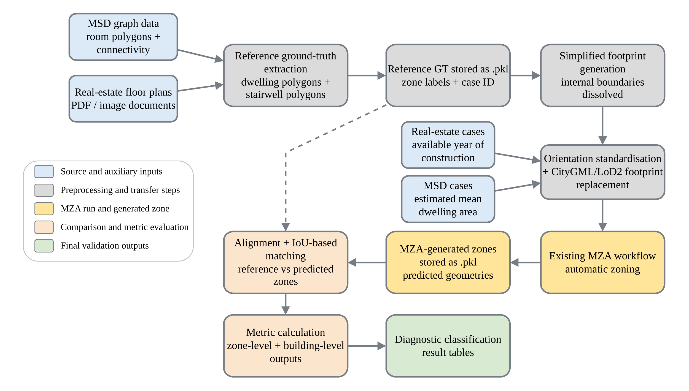

# MZA Validation Repository

This repository contains the code, processed validation data, and plotting scripts used for the geometric validation and the scripts for the sensitivity-analysis plots:

**Impact of Automated Thermal Zoning on Building Energy Simulations: Ground-Truth Validation and Sensitivity Analysis**

The main purpose of the repository is to compare automatically generated **Multizone Assignment Algorithm (MZA)** zoning output with reference **ground-truth dwelling and stairwell zones** extracted from floor-plan data.

The MZA itself is **not implemented in this repository**. It is executed in a separate repository. This repository prepares the input data, stores the MZA outputs, compares them with the reference ground truth, and generates validation tables and figures.

---

## What this repository is for

Use this repository to:

- inspect or regenerate MSD and real estate ground-truth polygons,
- prepare footprint-based CityGML input files for the external MZA workflow,
- compare MZA-generated zones with ground-truth zones,
- calculate geometric and topological validation metrics,
- generate diagnostic validation tables and plots,
- the sensitivity-analysis plotting scripts used for the thesis.

---

## Validation Workflow

The complete geometric validation workflow is shown below. It starts from the reference floor-plan sources, extracts dwelling and stairwell ground-truth polygons, prepares the simplified footprint and CityGML input for the external MZA workflow, and finally compares the MZA-generated zones with the reference ground truth using IoU-based matching, metric calculation, diagnostic classification, and validation figures.



*Figure: Implementation workflow for the geometric validation of MZA-generated dwelling and stairwell zones.*

---

## Repository structure

```text
.
├── README.md
├── environment.yml
├── data/
├── msd_ground_truth_extraction/
├── rd_ground_truth_extraction/
├── gml_footprint_replacement/
├── zoning_comparison/
├── zoning_comparison_metrics/
├── msd_dataset_creation/
├── sa_plotting_scripts/
├── report/
└── archive/
```

---

## Folder guide

### `data/`

This is the shared data folder used by the comparison scripts.

```text
data/
├── msd/
│   ├── msd_thesis_building_ids.txt
│   └── msd_predicted_buildings/
├── rd/
│   ├── rd_thesis_building_ids.txt
│   └── rd_predicted_buildings/
└── sa_building_data/
```

Important files and folders:

| Path | Purpose |
|---|---|
| `data/msd/msd_thesis_building_ids.txt` | MSD building IDs used in the thesis validation |
| `data/rd/rd_thesis_building_ids.txt` | Real estate case IDs used in the thesis validation |
| `data/msd/msd_predicted_buildings/` | MZA-predicted MSD outputs copied back from the external MZA workflow |
| `data/rd/rd_predicted_buildings/` | MZA-predicted real estate outputs copied back from the external MZA workflow |
| `data/sa_building_data/` | Building data used by the sensitivity-analysis plotting workflow |


### `msd_ground_truth_extraction/`

This folder contains the workflow for extracting ground-truth dwelling and stairwell polygons from the **Modified Swiss Dwellings (MSD)** graph data.

```text
msd_ground_truth_extraction/
├── main.py
├── msd_processing.py
├── constants_apt.py
├── utils_apt.py
├── data/
│   ├── raw_msd/
│   └── ground_truth/
├── figures/
└── debug/
```

The MSD workflow starts from graph-based room data. It removes auxiliary rooms, separates dwellings from shared circulation using entrance-edge logic, and merges room polygons into dwelling and stairwell reference zones.

Main output:

```text
msd_ground_truth_extraction/data/ground_truth/<building_id>.pickle
```


Use this folder when you want to regenerate or inspect MSD reference ground truth.

---

### `rd_ground_truth_extraction/`

This folder contains the workflow for extracting ground-truth polygons from **real estate floor-plan PDFs**.

```text
rd_ground_truth_extraction/
├── main.py
├── draw_polygons.py
├── display_polygons.py
├── scale_area.py
├── scale_known.py
├── scale_reference.py
├── save_pickle.py
├── data/
│   ├── raw_rd/
│   └── ground_truth/
└── figures/
```

The RD workflow starts from PDF floor plans. Dwelling and stairwell polygons are manually digitised, scaled to metric coordinates, classified, and saved as pickle files.

Input PDFs:

```text
rd_ground_truth_extraction/data/raw_rd/
```

Main output:

```text
rd_ground_truth_extraction/data/ground_truth/<case_id>.pickle
```

The thesis RD cases are numbered from `1` to `40`.

---

### `gml_footprint_replacement/`

This folder prepares CityGML/LoD2 input files for the external MZA workflow.

```text
gml_footprint_replacement/
├── main.py
├── footprint_extractor.py
├── gml_footprint_replacer.py
├── data/
│   ├── gml_template/
│   ├── msd/
│   └── rd/
├── figures/
└── debug/
```

This step converts a floor plan derived footprint into a GeoJSON footprint and replaces the footprint of a template CityGML/LoD2 building while keeping the vertical building structure.

Typical outputs:

```text
gml_footprint_replacement/data/msd/footprint/footprint_<id>.geojson
gml_footprint_replacement/data/msd/gml_replaced/LoD2_Berlin_Moabit_replaced_<id>.gml
```

For real estate data:

```text
gml_footprint_replacement/data/rd/footprint/footprint_<id>.geojson
gml_footprint_replacement/data/rd/gml_replaced/LoD2_Berlin_Moabit_replaced_<id>.gml
```

---

### `zoning_comparison/`

This folder contains the geometric comparison workflow.

```text
zoning_comparison/
├── matrix.py
├── footprint_visualization.py
├── constants_rd.py
├── utils_rd.py
├── figures/
└── output/
    ├── msd/
    └── rd/
```

This is the main folder for comparing ground truth and MZA predictions. It loads the ground-truth polygons and predicted MZA polygons, aligns them, matches regions using overlap, and calculates comparison metrics.

Main outputs:

```text
zoning_comparison/output/msd/all_global_stats_msd.csv
zoning_comparison/output/msd/all_region_metrics_msd.csv

zoning_comparison/output/rd/all_global_stats_rd.csv
zoning_comparison/output/rd/all_region_metrics_rd.csv
```

Output meaning:

| Output file | Meaning |
|---|---|
| `all_global_stats_*.csv` | Building-level validation results |
| `all_region_metrics_*.csv` | Zone-level / matched-region validation results |


---

### `zoning_comparison_metrics/`

This folder converts raw comparison metrics into diagnostic validation categories.

```text
zoning_comparison_metrics/
├── diagnostic_table_msd.py
├── diagnostic_table_rd.py
├── diagnostic_table_grouped.py
├── output/
│   ├── msd/
│   ├── rd/
│   └── combined/
└── debug/
```

Main outputs:

```text
zoning_comparison_metrics/output/msd/diagnostic_table_with_topology_msd.csv
zoning_comparison_metrics/output/msd/diagnostic_category_counts_with_topology_msd.csv

zoning_comparison_metrics/output/rd/diagnostic_table_with_topology_rd.csv
zoning_comparison_metrics/output/rd/diagnostic_category_counts_with_topology_rd.csv
```

Combined output:

```text
zoning_comparison_metrics/output/combined/
```

---

### `msd_dataset_creation/`

This folder contains auxiliary preprocessing scripts for MSD input estimation and dataset preparation.

```text
msd_dataset_creation/
├── apt_area_csv.py
├── building_piecewise_model.py
├── csv_apend_classification.py
├── csv_with_selected_or_nonselected_seperation.py
├── msd_processing.py
├── constants_msd.py
├── utils_msd.py
└── data_estimation_new_process/
```

This folder is mainly used for preparing or checking MSD-related auxiliary inputs, such as estimated dwelling area. It is not the main folder for running the geometric comparison.

---

### `sa_plotting_scripts/`

This folder contains plotting scripts and result folders for the sensitivity-analysis part of the thesis.

```text
sa_plotting_scripts/
├── plot_kpi_variant_thesis_style_single_panel.py
├── plot_event_windows_thesis_style_memorysafe_updated.py
├── plot_morris_results.py
├── plot_sobol_analysis.py
├── plot_sobol_overheating.py
├── plot_variant_zoning.py
├── sa_results/
└── output/
```

This folder is not required for the geometric comparison workflow. It is used to generate thesis figures for:

- zoning-variant KPI comparison,
- peak-heating and overheating event windows,
- Morris screening,
- Sobol sensitivity analysis,
- zoning variant visualisations.

---

### `report/`

This folder contains thesis documentation and report figures.

```text
report/
├── Master_Thesis_V3.pdf
├── figures/
└── report_plots/
```

Use this folder only for documentation, thesis figures, and report-related plotting scripts. The main geometric-comparison workflow does not depend on the thesis PDF.

---

### `archive/`

This folder contains older scripts, earlier plotting attempts, backup environments, and previous workflow versions.

```text
archive/
├── environment_full_backup.yml
├── gml_msd/
├── sa_old_plots/
├── zoning_comparison_metrics/
└── zoning_comparison_msd/
```

The archive is kept for traceability. It should not be used as the normal workflow unless an older implementation needs to be checked.

---

## Environment setup

Create the Conda environment from the repository root:

```powershell
conda env create -f environment.yml
conda activate mza-validation
```

---

## How to run the geometric comparison


The geometric comparison workflow has five main stages:

```text
1. Check or create the ground-truth pickle files
2. Create the CityGML/LoD2 input files for the external MZA workflow
3. Place the MZA-predicted files in the correct repository folders
4. Run the zoning comparison
5. Run the zoning metric and diagnostic classification scripts
```

---

### Step 1: Check or create ground-truth files

Before preparing the MZA input, check that every selected MSD or RD case has a corresponding ground-truth `.pickle` file.

MSD ground truth:

```text
msd_ground_truth_extraction/data/ground_truth/
```

RD ground truth:

```text
rd_ground_truth_extraction/data/ground_truth/
```

---

### Step 2: Create the CityGML input file for the MZA workflow

After the ground-truth files are available, create the simplified footprint and replace the footprint in the CityGML/LoD2 template building.

Use the scripts in:

```text
gml_footprint_replacement/
```

This step creates the CityGML input files that are later used in the external MZA repository.

Expected MSD output:

```text
gml_footprint_replacement/data/msd/gml_replaced/LoD2_Berlin_Moabit_replaced_<id>.gml
```

Expected RD output:

```text
gml_footprint_replacement/data/rd/gml_replaced/LoD2_Berlin_Moabit_replaced_<id>.gml
```

These `.gml` files are then transferred to the external MZA workflow.

### Step 3: Prepare the auxiliary input for the external MZA workflow

After creating the CityGML/LoD2 input file, the required auxiliary input must also be checked before running the external MZA workflow.

The auxiliary input is different for MSD and RD:

| Dataset | Auxiliary input required by MZA | Where it comes from                           |
| ------- | ------------------------------- | --------------------------------------------- |
| MSD     | Estimated mean dwelling area    | Estimated from MSD floor-plan characteristics |
| RD      | Year of construction            | Read from the real-estate metadata file       |

---

#### MSD: estimated mean dwelling area

For MSD cases, the typical apartment size must be estimated from the floor-plan-derived footprint area.

In the external MSD MZA repository, the relevant file is:

```text
rom_auto_multizoning_msd/multizoning/components/utils.py
```

Add the following helper function in `utils.py`, for example close to the other helper/configuration functions:

```python
def swiss_typical_apartment_size(building_info: dict) -> float:
    """
    Swiss deployment function (MSD-calibrated).

    Predicts the typical apartment size [m²] from the ground-floor
    footprint area A [m²] using a forced piecewise-linear model.

    Input:
        building_info:
            Dictionary containing the ground-floor polygon under:
            building_info["polygons"]["gf_polygon"]

    Output:
        y:
            Predicted typical apartment size [m²]
    """
    gf_polygon = building_info.get("polygons", {}).get("gf_polygon", None)

    if gf_polygon is None:
        raise ValueError("Missing building_info['polygons']['gf_polygon'].")

    A = float(gf_polygon.area)
    print("[footprint_area]", A)

    # Breakpoints
    b1 = 169.38
    b2 = 188.88
    b3 = 208.49
    b4 = 246.69
    b5 = 350.91

    # Piecewise regression
    if A <= b1:
        y = 19.897 + 0.297024 * A
    elif A <= b2:
        y = -26.387 + 0.567679 * A
    elif A <= b3:
        y = 64.747 + 0.093710 * A
    elif A <= b4:
        y = -7.754 + 0.425586 * A
    elif A <= b5:
        y = 59.374 + 0.044637 * A
    else:
        y = 52.649 + 0.072966 * A

    # Safety clamp for deployment
    y = max(30.0, min(y, 150.0))

    print("[typical_apt_area_m2]", y)

    return float(y)
```

Then, in the same external MZA script, go to the location where the typical apartment size is selected. In the current MSD MZA script, this is around **line 2525**.

Replace the German building-stock unit-size selection:

```python
# Typische Wohnungsgröße (m²)
m2_per_unit = pick_unit_size_m2(bd, config)    # for German building stock
```

with the MSD-calibrated footprint-based estimation:

```python
m2_per_unit = swiss_typical_apartment_size(building_info)  # for Swiss/MSD building stock
```

This ensures that the external MZA workflow uses the MSD-specific estimated mean dwelling area instead of German building-stock assumptions.

---

#### RD: year of construction

For RD cases, the year of construction is stored in:

```text
rd_ground_truth_extraction/data/rd_metadata.xlsx
```

Before running the external MZA workflow for an RD case, check the year of construction for the corresponding RD case ID.

This year of construction must then be used in the external MZA script to select the correct `unit_size_m2` class.

In the external MZA repository, the relevant file is:

```text
rom_auto_multizoning_rd/multizoning/components/utils.py
```

In this file, go to the unit_size_m2 dictionary. In the current RD MZA script, this part is located around line 2317. The relevant block looks like this:

```python
"unit_size_m2": {
    "MFH": {
        "pre_1919": 68.0,
        "1919_1945": 65.0,
        "1946_1970": 68.0,
        "1971_1990": 70.0,
        "1991_1994": 72.0,
        "post_1995": 75.0,
        "fallback": 70.0,
    },
    "UNKNOWN": {
        "fallback": 94.0,
    },
}
```

Use the RD year of construction to choose the corresponding year class

This value should be used in the external MZA workflow.

After this, run the external MZA workflow. The generated prediction files can then be copied back into this repository for geometric comparison.

---

### Step 4: Place the predicted MZA output files

Run the MZA in the external repository using the generated CityGML/LoD2 input files.

After the MZA run is complete, copy the predicted output files back into this repository.

MSD predictions:

```text
data/msd/msd_predicted_buildings/csv/
data/msd/msd_predicted_buildings/pkl/
```

RD predictions:

```text
data/rd/rd_predicted_buildings/csv/
data/rd/rd_predicted_buildings/pkl/
```

The prediction ID must match the ground-truth ID.


---

### Step 5: Run the zoning comparison

After the ground-truth files and predicted MZA files are in place, run the zoning comparison.

Use the active comparison script in:

```text
zoning_comparison/
```

The comparison aligns the ground-truth and predicted geometries, performs IoU-based matching, and calculates building-level and zone-level metrics.

After the script runs, check the output folders:

```text
zoning_comparison/output/msd/
zoning_comparison/output/rd/
```

Expected MSD outputs:

```text
zoning_comparison/output/msd/all_global_stats_msd.csv
zoning_comparison/output/msd/all_region_metrics_msd.csv
```

Expected RD outputs:

```text
zoning_comparison/output/rd/all_global_stats_rd.csv
zoning_comparison/output/rd/all_region_metrics_rd.csv
```

---

### Step 6: Run zoning metrics and diagnostic classification

After the raw comparison tables are created, run the diagnostic scripts.


Diagnostic outputs are written to:

```text
zoning_comparison_metrics/output/msd/
zoning_comparison_metrics/output/rd/
zoning_comparison_metrics/output/combined/
```

The diagnostic scripts use the comparison outputs to classify each case into validation categories and to generate summary tables and figures.

---

## Short route after MZA has already been run

If the ground-truth files and MZA-predicted files already exist, the short route is:

```text
1. Check the ID list
2. Check the ground-truth pickle files
3. Check the predicted MZA .csv/.pkl files
4. Run zoning comparison
5. Run zoning metrics / diagnostic classification
```

In this case, the CityGML input preparation step does not need to be repeated unless the footprint, orientation, or selected building cases have changed.

---

## Adding a new MSD building

1. Add the building ID to:

```text
data/msd/msd_thesis_building_ids.txt
```

2. Add or generate the ground-truth file:

```text
msd_ground_truth_extraction/data/ground_truth/<building_id>.pickle
```

3. Generate the MZA input file using `gml_footprint_replacement/` if needed.

4. Run the external MZA workflow.

5. Copy the MZA outputs back to:

```text
data/msd/msd_predicted_buildings/csv/building_data_<building_id>.csv
data/msd/msd_predicted_buildings/pkl/building_data_<building_id>.pkl
```

6. Run the comparison and diagnostic scripts.

---

## Adding a new real estate case

1. Add the case ID to:

```text
data/rd/rd_thesis_building_ids.txt
```

2. Add the raw floor-plan PDF if the ground truth still needs to be generated:

```text
rd_ground_truth_extraction/data/raw_rd/<case_id>.pdf
```

3. Add or generate the ground-truth file:

```text
rd_ground_truth_extraction/data/ground_truth/<case_id>.pickle
```

4. Generate the MZA input file using `gml_footprint_replacement/` if needed.

5. Run the external MZA workflow.

6. Copy the MZA outputs back to:

```text
data/rd/rd_predicted_buildings/csv/building_data_<case_id>.csv
data/rd/rd_predicted_buildings/pkl/building_data_<case_id>.pkl
```

7. Run the comparison and diagnostic scripts.

---

## Naming rules

The ID must be consistent across all folders.

### MSD example

```text
data/msd/msd_thesis_building_ids.txt
10277

msd_ground_truth_extraction/data/ground_truth/10277.pickle
data/msd/msd_predicted_buildings/csv/building_data_10277.csv
data/msd/msd_predicted_buildings/pkl/building_data_10277.pkl
```

### RD example

```text
data/rd/rd_thesis_building_ids.txt
1

rd_ground_truth_extraction/data/ground_truth/1.pickle
data/rd/rd_predicted_buildings/csv/building_data_1.csv
data/rd/rd_predicted_buildings/pkl/building_data_1.pkl
```

If one file is missing or the ID names do not match, the comparison will fail or skip that case.

---

## Troubleshooting

Before changing the code, first check that the input and output file paths in the active script point to the correct repository folders. Some scripts use hard-coded path variables near the top of the file, so an old absolute path or a wrong relative path can cause missing files, empty outputs, or results being saved in the wrong location.

| Problem                                    | Likely cause                                                                                                                        |
| ------------------------------------------ | ----------------------------------------------------------------------------------------------------------------------------------- |
| File not found                             | ID mismatch, missing prediction file, missing ground-truth file, or wrong input path                                                |
| Empty output table                         | Wrong input folder, wrong dataset switch, missing ID list, or script reading from an empty directory                                |
| Output file is not created                 | Output folder does not exist, output path points to the wrong location, or script was not run from the repository root              |
| Output saved in an unexpected folder       | Relative paths are being resolved from the current terminal location instead of the repository root                                 |
| Very low IoU for all cases                 | Scale, orientation, coordinate-system mismatch, or wrong prediction file used for the selected ground truth                         |
| Only some cases fail                       | Case-specific MZA output issue, ground-truth extraction issue, or missing/corrupted file for that ID                                |
| Diagnostic script fails                    | Raw comparison CSV files have not been generated yet or the diagnostic script points to the wrong comparison output folder          |
| Figure paths do not render on GitHub       | PDF was linked directly instead of exporting to PNG                                                                                 |
| Correct files exist but script still fails | The script configuration still points to an old local path instead of the repository `data/`, `ground_truth/`, or `output/` folders |

### Path checks

For each selected ID, check that the paths match the expected structure.

MSD ground truth:

```text
msd_ground_truth_extraction/data/ground_truth/<building_id>.pickle
```

MSD prediction:

```text
data/msd/msd_predicted_buildings/csv/building_data_<building_id>.csv
data/msd/msd_predicted_buildings/pkl/building_data_<building_id>.pkl
```

RD ground truth:

```text
rd_ground_truth_extraction/data/ground_truth/<case_id>.pickle
```

RD prediction:

```text
data/rd/rd_predicted_buildings/csv/building_data_<case_id>.csv
data/rd/rd_predicted_buildings/pkl/building_data_<case_id>.pkl
```

Expected comparison outputs:

```text
zoning_comparison/output/msd/
zoning_comparison/output/rd/
```

Expected diagnostic outputs:

```text
zoning_comparison_metrics/output/msd/
zoning_comparison_metrics/output/rd/
zoning_comparison_metrics/output/combined/
```

A common source of errors is mixing old absolute paths, such as local dataset folders, with the cleaned repository paths. For the cleaned repository, scripts should read from the repository `data/` and `ground_truth/` folders and write results to the corresponding `output/` folders.

## Notes

- The MZA is treated as an external process.
- Raw source datasets are not fully included in this repository.
- The geometric validation compares dwelling/stairwell polygons, not room-level layouts.
- Large simulation outputs are not part of the normal geometric-comparison workflow.
- Most scripts use hard-coded paths or configuration blocks near the top of the file. Check these paths before running the scripts on another machine.
- The `archive/` folder is kept for traceability and should not be the starting point for normal use.
